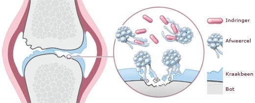
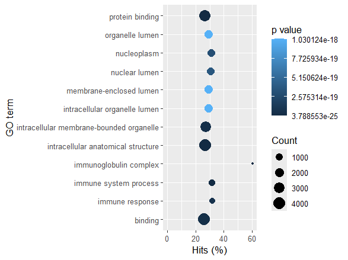

# Transcriptomics

  

  <em>bron: <a href="https://www.umcutrecht.nl/nl/ziekte/reuma">UMC Utrecht - Reuma</a></em>

  Door: Elbrich Bouma

Klas: LBM2-C

---
## Inhoud/Structuur
- `Assets/` - overige documenten en afbeeldingen voor de opmaak van deze pagina
- `Bronnen/` - gebruikte bronnen voor het onderzoek
- `Data_stewardship/` - document met het belang van data stewardship
- `Data/` – de data gebruikt in dit onderzoek
- `Data/BAM-files` - verwerkte datasets als BAM-files gegenereerd met het R-script
- `Resultaten/` - grafieken en tabellen gegenereed met het R-script

---
## H1 Inleiding
Reumatoïde artritis (RA) is een auto-immuunziekte gevonden in 0.5-1.0% van de wereldbevolking die die leidt tot langdurige gewrichtsontstekingen en aantasting van meerdere organen ([Kochi et al., 2014](Bronnen/Kochi_Y_2014.pdf)). RA is een erfelijke aandoening waarbij ongeveer 60% genetisch bepaald is, 30% hiervan wordt veroorzaakt door het HLA-DRB1 gen. Vooral veranderingen in ‘shared epitopes’, een belangrijk gebied binnen MHC klasse II-genen, heeft effect hierop ([Shakeel et al., 2025](Bronnen/Shakeel_L_2025.pdf)). Een ander gen sterk betrokken bij RA dat niet op het HLA regio ligt is PTPN22. Dit gen verminderd de signalen van B- en T-cell reptoren ([Kochi et al., 2014](Bronnen/Kochi_Y_2014.pdf)). De 1858t variant is een goede voorspellende marker voor de ontwikkeling van RA, vooral in combinatie met anti-citrullinated protein antibodies (ACPAs) ([Chang et al., 2016](Bronnen/Chang_HH_2016.pdf)). Hoewel deze genen veel betrokken zijn bij RA, is er nog niet een duidelijke oorzaak voor RA. Er zijn veel verschillende genen die invloed hebben op het ontwikkelen van RA. Het doel van dit onderzoek is het identificeren van genen betrokken bij RA m.b.v. transcriptomics data-analyse in R. Met als deelvraag: welke biologische pathways zijn betrokken bij de genetische factoren van RA?

---
## H2 Methode
Om de genen en pathways betrokken bij RA te identificeren, werd gebruik gemaakt van transcriptomics in [R](Data/Project Transcriptomics.R). (figuur 1).

  

*Figuur 1: Stroomschema van de dataverwerking in R, gemaakt met behulp van Biorender.*

### H2.1 Dataset
Voor de [samples](Data/samples.md) werden 4 synoviumbiopten van RA-patiënten (diagnose >12 maanden, ACPA-positief) en 4 van controles (ACPA-negatief) gesequenced. Hierna werd met R (versie 4.5.1) een Transcriptomics analyse uitgevoerd. 

### H2.2 Mapping en countmatrix
Er werd een genoomindex ontworpen gebaseerd op humaan genoom uit het SRA database (GRCH38.p14) en de reads werden hier tegen uitgelijnd met behulp van RSUBread (versie 2.22.1) ([Liao, et al., 2013](Bronnen/Liao_Y_2013.pdf)) . Hieruit volgen [BAM-bestanden](Data/BAM-files/) waaruit de reads werden gemapt met een humaan GTF-annotatiebestand (GRCh38.p14). Het aantal reads dat op elk gen valt werd geteld in een [countmatrix](Data/count_matrix.txt).

### H2.3 Statistiek
Met behulp van de [countmatrix](Data/count_matrix.txt) werd een differentiële genexpressie-analyse uitgevoerd met behulp van DESeq2 (versie 1.48.1) ([Love, et al., 2014](Bronnen/Love_M_I_2014.pdf)) en gevisualiseerd met een vulcanoplot. Verder werd een GO-enrichmentanalyse uitgevoerd m.b.v. goseq (versie 1.60.0) ([Young, et al., 2010](Bronnen/Young_M_D_2010.pdf)) en een KEGG-pathway analyse m.b.v. KEGGREST (versie 1.48.0) ([Guan, et al., 2024](Bronnen/Guan_Y_2024.pdf)).

---
## H3 Resultaten
Om te achterhalen welke genen en pathways een rol spelen bij RA, werd de data geanalyseerd met behulp van een vulcanoplot, GO-enrichment en een pathway analyse.

### H3.1 Vulcanoplot
Om inzicht te krijgen in de genen die significant op- of neergereguleerd zijn bij RA, werd een volcano plot gemaakt. Hieruit bleek dat 2085 genen significant waren opgereguleerd en 2487 genen significant neergereguleerd (figuur 2).

  

*Figuur 2: Volcanoplot van de differentiële genexpressie bij reumapatiënten (N=4) en de controles (N=4).*

### H3.2 GO-analyse
Om een overzicht te krijgen van welke biologische processen significant betrokken zijn bij RA, werd een GO-analyse uitgevoerd. Hieruit bleek dat het proces met de meest significante expressieverandering betrekking heeft op het intracellulaire anatomische structuur (p = 3.78* 10-25)  (figuur 3).

  

*Figuur 3: Go-enrichmentplot van de tien GO-termen met laagste gecorrigeerde p-waarden (Padj <0.05).*

### H3.3 Versterkt Th1-activiteit en verzwakt Th17-activiteit
Om de genexpressie bij RA-patiënten te analyseren, werden de gegevens vergeleken met het Rheumatoid Arthritis-pathway. Hierbij bleek dat meerdere genen kenmerkend voor Th1-cellen, zoals CD28, IFN-γ en T-bet, significant waren opgereguleerd, wat duidt op een verhoogde Th1-celrespons (figuur 4/5). Hoewel IL6 bij Th17-cellen was opgereguleerd, waren belangrijke eiwitten zoals TGF-β, IL23 en IL-17 juist neergereguleerd (figuur 4). Dit wijst op verminderde activiteit in Th17-cellen.

  

*Figuur 4: Pathways en genen betrokken bij Reumatoïde Artritis (KEGG: hsa05323) gebaseerd op de log2Fold change van de genen met een gecorrigeerde p-waarde <0.05. Waarbij opgereguleerde genen groen gekleurd en neergerugeleerde genen rood gekleurd zijn.*

  

*Figuur 5: Pathways en genen betrokken bij de differentiatie van Th1 en Th2 cellen (KEGG: hsa04658), gebaseerd op de log2Fold change van de genen met een gecorrigeerde p-waarde <0.05. Waarbij opgereguleerde genen groen gekleurd en neergerugeleerde genen rood gekleurd zijn.*
  
*Tabel 1: De functie en verandering in expressie van verschillende proteïnes.*
| Proteïne | Regulatie   | Functie                                                                                                                             | Bron      |
|----------|-------------|-------------------------------------------------------------------------------------------------------------------------------------|-----------|
| TGF-β    | ▼ neer      | Stimuleert de differentiatie van CD4 T-cellen tot Treg cellen, die ontstekingen onderdrukken.                                       | ([Grebenciucova & VanHaerents, 2023](Bronnen/Grebenciucova_&_VanHaerents_2023.pdf))     |
| IL-6     | ▲ op        | Blokkeert TGF-β en stimuleert de differentiatie van CD4 T-cellen tot Th17 cellen. Th17 cellen stimuleren ontstekingen.              | ([Grebenciucova & VanHaerents, 2023](Bronnen/Grebenciucova_&_VanHaerents_2023.pdf))     |
| IL-23    | ▼ neer      | Bevordert de overleving en vermeerdering van Th17 cellen en stimuleert de productie van cytokines zoals IL17 en IL22.               | ([García-Domínguez, 2025](Bronnen/García-Domínguez_2025.pdf))     |
| IL-17    | ▼ neer      | Stimuleert ontstekingsmediatoren zoals cytokines, chemokines en antimicrobiële peptiden en bevordert de activatie van neutrofielen. | ([Majumder & McGeachy, 2021](Bronnen/Majumder_&_McGeachy_2021.pdf))     |
| CD28     | ▲ op        | Co-stimulerend eiwit die helpt bij T-celactivatie en IL-2 en IFN-γ productie versterkt.                                             | ([Porciello & Tuosto, 2016](Bronnen/Porciello_&_Tuosto_2016.pdf)) ([Haack, et al., 2021](Bronnen/Haack_S_2021.pdf))   |
| IFN-γ    | ▲ op        | Activeert het STAT1 signaal wat leidt tot opregulatie van T-bet                                                                     | ([Sun, et al., 2023](Bronnen/Sun_L_2023.pdf))     |
| T-bet    | ▲ op        | Belangrijk eiwit voor Th1 differentiatie en onderdrukt Th2 en Th17. Het stimuleert en versterkt de productie van IFN-γ.             | ([Sun, et al., 2023](Bronnen/Sun_L_2023.pdf))     |

---
## H4 Conclusie
In dit onderzoek zijn genen en pathways betrokken bij reumatoïde artritis (RA) geanalyseerd met transcriptomics in R. TGF-β bleek sterk neergereguleerd, terwijl IL-6 sterk opgereguleerd was, wat duidt op verhoogde activiteit van Th17. Opvallend was echter dat IL-23 licht en IL-17 sterk neergereguleerd waren, wat niet overeenkomt met het typische RA-profiel. Ondanks hoge IL-6-activiteit waren er dus weinig actieve Th17-cellen. Daarentegen was de Th1-respons sterk, te zien aan de opregulatie van IFN-γ, T-bet, CD28 en MHC II. Dit kan verklaard worden doordat de samples afkomstig waren uit synoviumbiopten, waar Th1-cellen een prominente rol spelen. Wel wordt hier normaal ook verhoogde IL-17-expressie gezien ([Yamada, et al., 2015](Bronnen/Yamada_H_2015)). Een mogelijke verklaring voor de lage IL-17-niveaus is de cellulaire plasticiteit van Th17-cellen: deze kunnen Th1-eigenschappen aannemen en meer IFN-γ produceren in plaats van IL-17 ([Mills, 2022](Bronnen/Mills_KGH_2022)). Mogelijk is het immuunbeeld bij deze patiënten verschoven van Th17- naar Th1-dominantie. Dit onderzoek toont aan dat meerdere genen en pathways betrokken zijn bij RA, en dat visualisatie van genactiviteit het ziektebeeld verduidelijkt. Echter doordat de analyse gebaseerd is op patiënten met langdurige RA (>12 maanden), blijven de vroege stadia van de ziekte onderbelicht.
